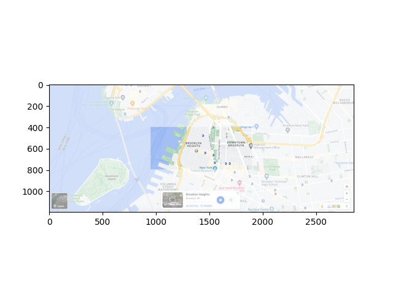
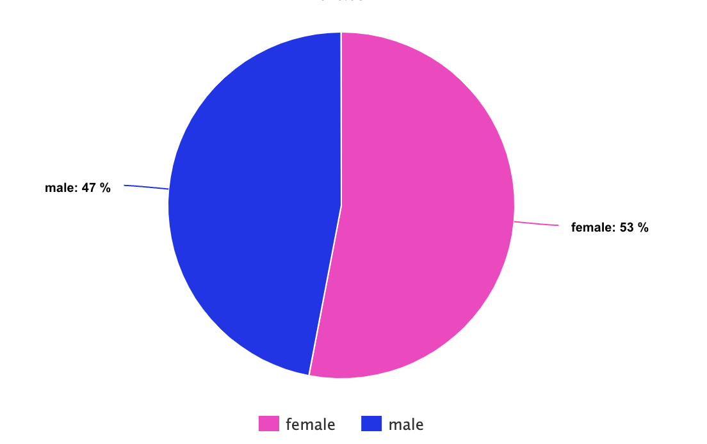
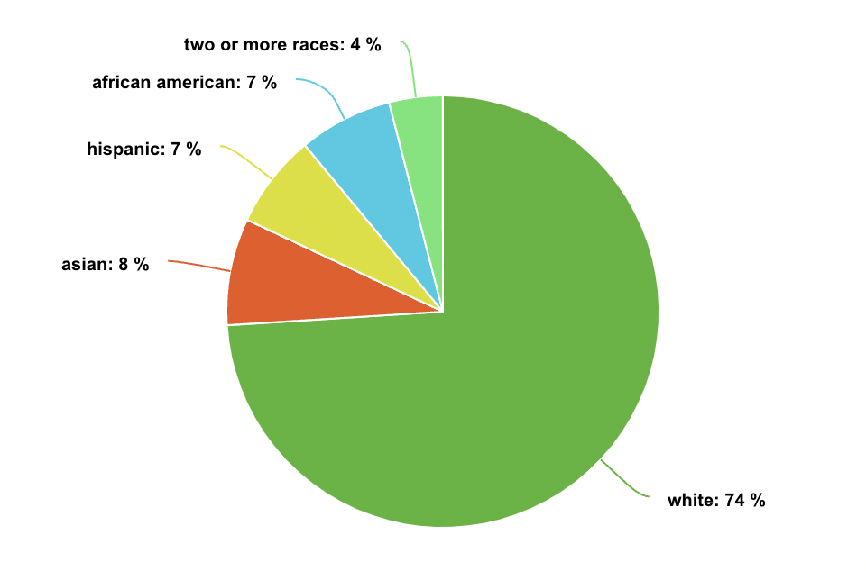
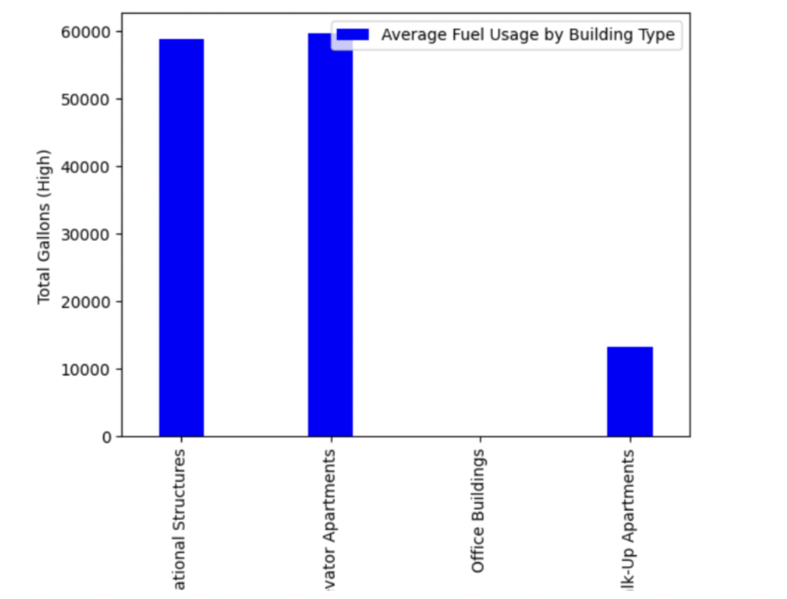
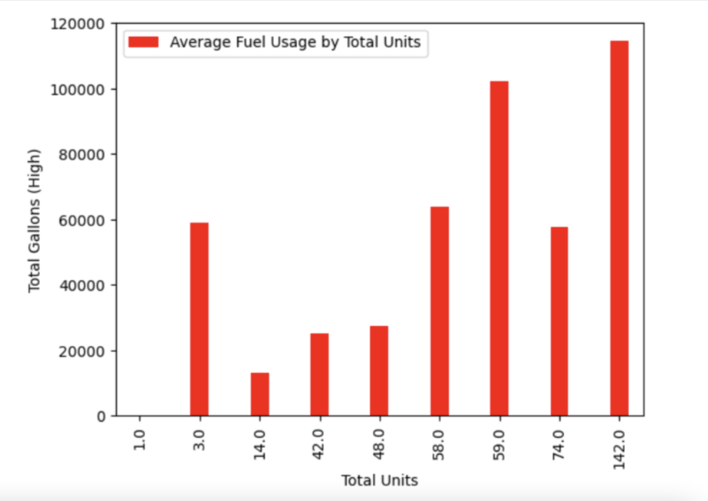

# Brooklyn Heights

## The Data Breakdown

### Gender Demographics

### Race Demographics

### Education

### Income & Housing

- Average Income: $213,208/year
- 31,084 households; 33,948 housing units w/ average rent at $2,800

# NYC Clean Heat Programs

The NYC Clean Heat program encourages residents, workers and other individuals to pursue sustainable heating and cooling that doesn’t harm the environment. Through the Clean Heat program, the installment of cold climate air source heat pumps (ASHP), energy efficient ground source heat pumps (GSHP), along with heat pump water heaters (HPWH), heat pumps provide more convenience and eco-friendly alternatives. The NYC Clean Heat program improves the lifestyle of individuals through the use of renewable energy in the form of heat pumps, as well as improving the health of the people who invest in such heat pumps along the way. The DEP Boiler Registration was created to monitor and minimize the amount of soot pollution that is going into the air; the process of inspecting each boiler is meant to help keep the air clean and prevent further declining air quality. Moreover, the Greener Greater Buildings Plan has been enacted to target a set of buildings in NYC that is responsible for 45% of the entire city’s energy usage and encourage them to turn to greener methods of energy sorcing. The GGBP is a part of a larger plan, PlaNYC, which aims to promote sustainable growth through 2030.

# NYC Emisions

Only about 25% of buildings in NYC have an energy efficiency rating of A, and NYC’s greenhouse gas emissions are made up almost entirely from the combustion of fossil fuels. The City estimated that more than 40% of all energy consumed within the city’s buildings was used to heat or cool building spaces. As 75% of the city’s GHG emissions are related to buildings, heating and cooling directly affect over 30% of the city’s carbon footprint. Moreover, combustion of natural gas and petroleum from cooking emits carbon dioxide, methane, and nitrous oxide; emissions from the production and consumption of food are the third largest contributing factor to NYC’s greenhouse emissions. Back in May, New York passed a bill to ban the use of fossil fuels in new buildings, effective in 2026 (for buildings under seven stories). For bigger buildings, the ban will take effect in 2029. Gas stoves and furnaces will be banned, and construction will have to include all-electric alternatives (only affects new buildings–old ones will not be affected). NYC emissions are extremely high, but there are substantial measures being taken to counteract that. For instance, by using sustainable methods such as using 45 LED lighting retrofits, the installation of 22 smart building monitor systems which manage lighting, heating and air conditioning, and 30 HVAC upgrades in design or construction, the Brooklyn Public Library was able to achieve a 40% reduction in its greenhouse gas emissions, saving 3,500 metric tons of carbon dioxide.

# BK Heights Emissions Data

We already know how old the city as a whole is, but Brooklyn is also the most population dense; it's ALSO incredibly residential, so we weren't sure what to expect going in. Brooklyn Heights is considered the city's first suburb, so I was expecting it to be lower than the others(which was true!).

As mentioned, Brooklyn Heights is residential, but I still wanted to check the fuel levels by building type. As expected, there were no recorded office buildings, but elevator apartments had the highest fuel usage for obvious reasons.

Brooklyn Heights has the lowest number of housing units, but I decided to check by them anyways. The most population dense use an astronomical amount of fuel, as you can see. Despite that, it ranks on the lower side in fuel usage in Brooklyn.

<dl>
<iframe src="bkheightsmap.html" width="600" height="400" frameborder="0" frameborder="0" marginwidth="0" marginheight="0" allowfullscreen></iframe>
</dl>
